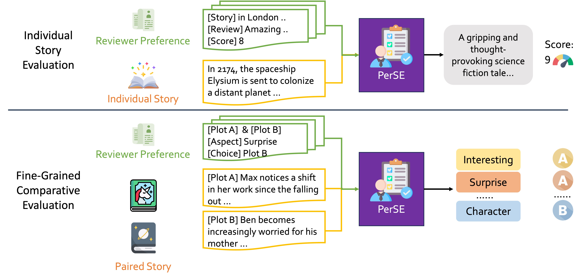
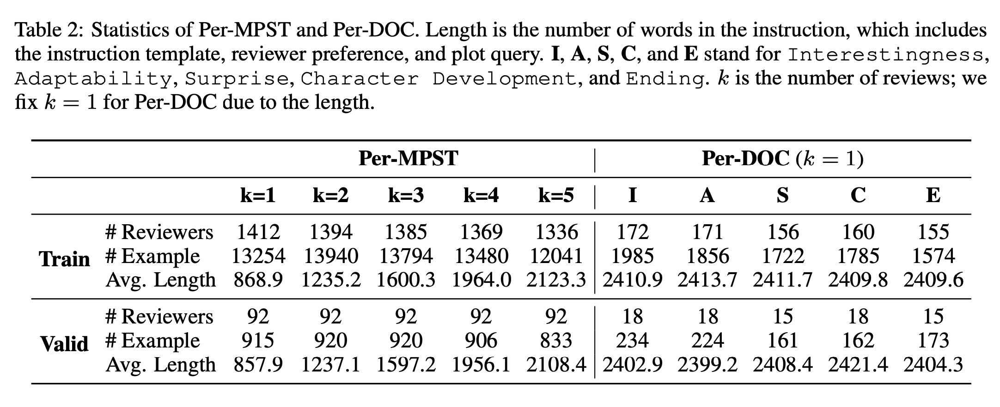
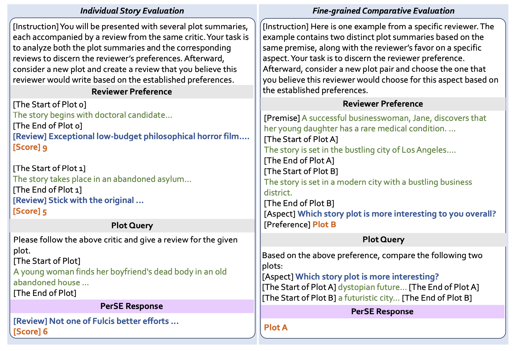
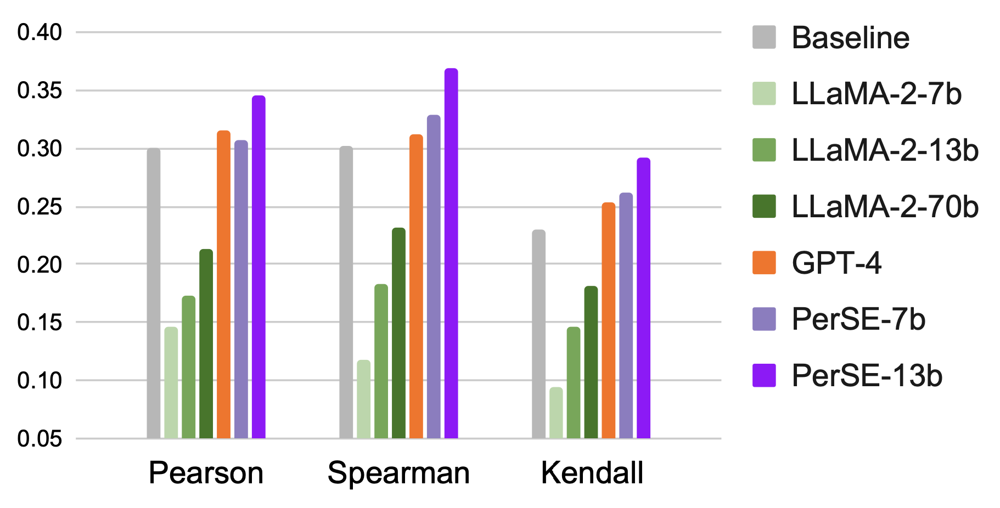
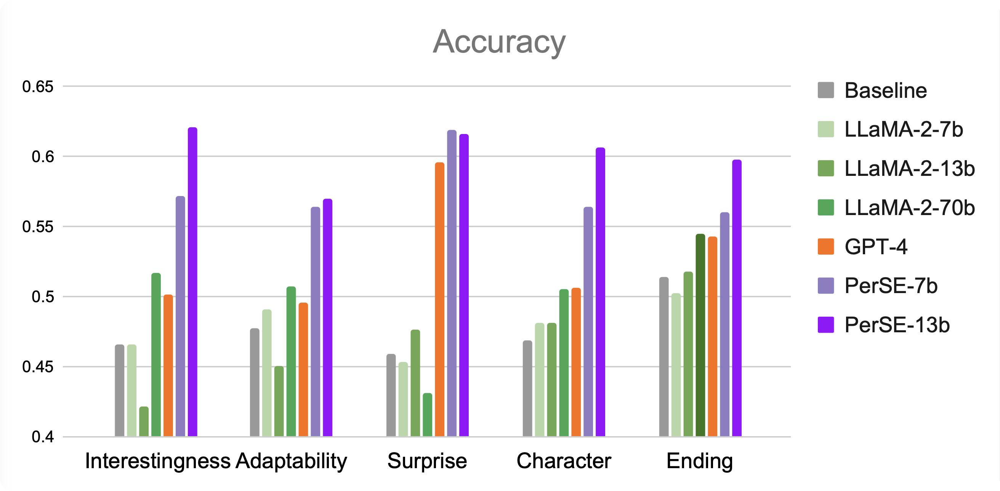

# PerSE
This is the repository for the paper: *Learning Personalized Story Evaluation*.



## Personalized Story Evaluation Dataset
We re-purpose two story datasets for personalized story evaluation: **PerMPST** and **PerDOC**. 

* **PerMPST**: Each example consists of several annotated reviews (k = 1 to 5) from the same reviewer and a new plot to be evaluated. Each annotated review includes anonymized and summarized moive plot, a detailed review text, and a score (from 1 to 10, 1 is the lowest).
* **PerDOC**: Each example consists for one annotated review and a new paired story to be evaluated. The annotated review includes two story plots derived from the same premise, personalized comparison results on five aspects (*Interestingness*, *Adaptability*, *Surprise*, *Character Development* and *Ending*).


The dataset statistic is listed below. More detailed information can be found in the paper and appendix.
We provide several examples in *data/* directory, and the full dataset will be available in [PerMPST](https://dl.fbaipublicfiles.com/perse/PerMPST.tar.gz) and [PerDoc](https://dl.fbaipublicfiles.com/perse/PerDOC.tar.gz).




## Personalized Story Evaluation Model (PerSE)
We develop **Per**sonalized **S**tory **E**valuation model (**PerSE**) to provide reviewer-specific evaluation on stories. It can provide a detailed review and a score (1-10) for one individual story, or compare two stories on five fine-grained aspects (*Interestingness*, *Adaptability*, *Surprise*, *Character Development* and *Ending*). 

It is instrution tuned from [LLaMA-2](https://github.com/facebookresearch/llama) using the following prompt format:



### Setup

We recommand using conda environment to set up.
```shell
$ conda create -n perse python=3.9
$ conda activate perse
$ pip install -r requirements.txt
$ pip install -e .
```

Before start, download PerMPST and PerDOC from the provided links. We provide  `src/scripts/convert_data.py` to convert the original dataset to the training format. For example, to convert the sample data, the command is:

``` shell
$ cd src
$ python scripts/convert_data.py --input_file ../data/PerMPST.k3.
sample.jsonl --output_file ../data/PerMPST.k3.src.json
```
Then *PerMPST.k3.src.json* can be used for the training. For inference, we do not need to covert the data.

### Training

We use deepspeed to speed up the training phase. The config file for deepspeed is `src/configs/ds_config_zero3.json`. We use 8 x 80G A100 GPU for training, set the batch size to 4 and learning rate to 1e-5. More options can be found in `src/finetune.py`. The training command should be something like:

``` shell
$ cd src
$ deepspeed --num_gpus 8 finetune.py --data_file ../data/PerMPST.k3.src.json --save_dir ../checkpoints/
```

### Inference

We provide two modes for interence. One is to evaluate the test set (**evaluate**) and the other is to receive command line input (**interactive**). We refer readers to `src/inference.py` for detailed information. For evaluation, a typical inference command is:

``` shell
$ cd src
$ python inference.py --input_file ../data/PerMPST.k3.sample.jsonl --ckpt checkponints/checkpoint-10
```

### Others

We provide several scripts for post-process and to calculate the correlation. Please check `scripts/get_comparison.py` and `get_score.py` for more information.

### Results

**Individual Story Evaluation on PerMPST**
The results are the correlation between the human rating and the model prediction.



**Fine-grained Comparative Evaluation on PerDOC**
The results are the prediction accuracy between the human label and the model prediction.
